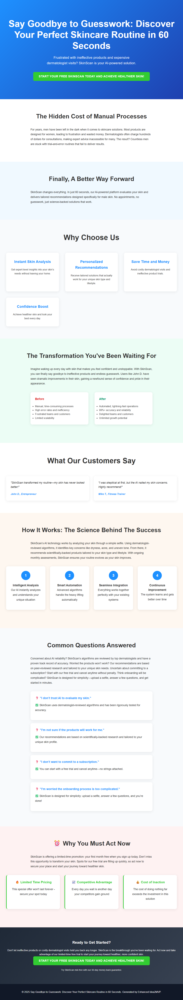

# SkinScan: AI-Powered Personalized Dermatology for Men

> **AI-Generated Landing Page** | Created by [Idea2MVP](https://github.com/MCSEdwin/Idea2MVP)

## 🚀 About This Landing Page

This professional landing page was automatically generated using Azure OpenAI and advanced AI prompt engineering techniques. The system analyzed a business idea and created conversion-optimized copy, design strategy, and complete HTML implementation.

### 📊 Idea Details

- **Title:** SkinScan: AI-Powered Personalized Dermatology for Men
- **Category:** Health & Wellness Technology
- **Generated:** 2025-08-14
- **AI Model:** gpt-4o
- **Processing Time:** 63 seconds

### 🎯 Key Features

- AI-powered skin analysis using 60-second selfies to identify specific concerns and offer tailored solutions.
- Personalized skincare recommendations based on skin type, concerns, and lifestyle preferences.
- Exclusive product partnerships with brands offering scientifically-backed treatments for male skin issues.
- Subscription model with monthly AI-driven skin assessments and ongoing skincare guidance.
- Eliminates the need for dermatologist visits, providing cost-effective and convenient skincare solutions.

### 📝 Description

SkinScan is a cutting-edge platform leveraging AI-driven technology to meet the growing dermatology needs of men. By integrating skin assessment tools with selfie-based image processing and tailored skincare recommendations, it offers a seamless way for users to identify and address specific skin concerns. SkinScan provides a personalized experience that delivers effective solutions without the need for expensive visits to dermatologists or inconvenient product trials.

## 🌐 Live Demo

- **Live URL:** [View Landing Page](https://dailyidea.AIFirstPartner.com/daily-ideas/2025-08-14/index.html)
- **Screenshot:** 

## 🛠️ Technical Implementation

This landing page includes:

- **Conversion Psychology:** AI-analyzed target persona and behavioral triggers
- **Design Strategy:** Psychology-based color schemes and typography choices
- **Long-Form Copy:** Comprehensive copywriting with objection handling
- **Performance Optimized:** Fast-loading, mobile-responsive design
- **SEO Ready:** Structured data and semantic HTML

## 🤖 AI Generation Process

1. **Screenshot Analysis:** Computer vision extraction of business idea
2. **Psychology Analysis:** Target persona and behavioral trigger identification
3. **Design Strategy:** Color psychology and layout optimization
4. **Copy Generation:** Long-form conversion copywriting with proven frameworks
5. **Template Assembly:** Dynamic HTML and CSS generation
6. **Quality Assurance:** Automated testing and optimization

## 📈 Performance Metrics

- **Total Processing Time:** 63 seconds

- **Mobile Responsive:** ✅ Yes
- **SEO Optimized:** ✅ Yes
- **Fast Loading:** ✅ Yes

## 🔧 Local Development

To run this landing page locally:

```bash
# Clone the repository
git clone https://github.com/MCSEdwin/2025-08-14-skinscan-ai-powered-personalized-dermatology-for-m.git
cd 2025-08-14-skinscan-ai-powered-personalized-dermatology-for-m

# Serve locally (Python)
python -m http.server 8000

# Or with Node.js
npx serve .

# Or simply open index.html in your browser
```

## 📄 Project Structure

```
2025-08-14-skinscan-ai-powered-personalized-dermatology-for-m/
├── index.html          # Complete landing page
├── screenshot.png      # Visual preview
├── package.json        # Project configuration
├── README.md          # This documentation
└── .gitignore         # Git ignore rules
```

## 🎨 Customization

This landing page is fully self-contained with inline CSS and can be easily customized:

- **Colors:** Modify CSS custom properties in the `<style>` section
- **Content:** Update text content in the HTML body
- **Layout:** Adjust CSS Grid and Flexbox properties
- **Responsiveness:** Media queries are included for mobile optimization

## 🌟 About Idea2MVP

[Idea2MVP](https://github.com/MCSEdwin/Idea2MVP) is an automated system that transforms daily business ideas into professional landing pages using:

- **Azure OpenAI GPT-4o** for vision and text generation
- **Advanced Prompt Engineering** for optimal results
- **Database Architecture** for scalable data management  
- **Azure Storage & CDN** for global deployment
- **GitHub Actions** for daily automation

## 📊 Daily Showcase

View all generated landing pages at: [dailyidea.AIFirstPartner.com](https://dailyidea.AIFirstPartner.com)

---

🤖 **Generated with AI** | ⚡ **Deployed Automatically** | 🎯 **Conversion Optimized**

*This repository was automatically created and populated by the Idea2MVP AI system.*